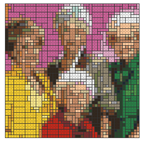
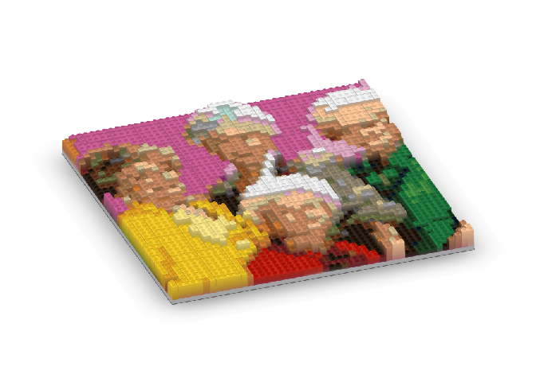
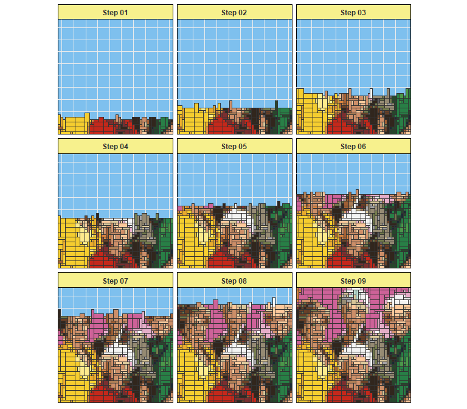
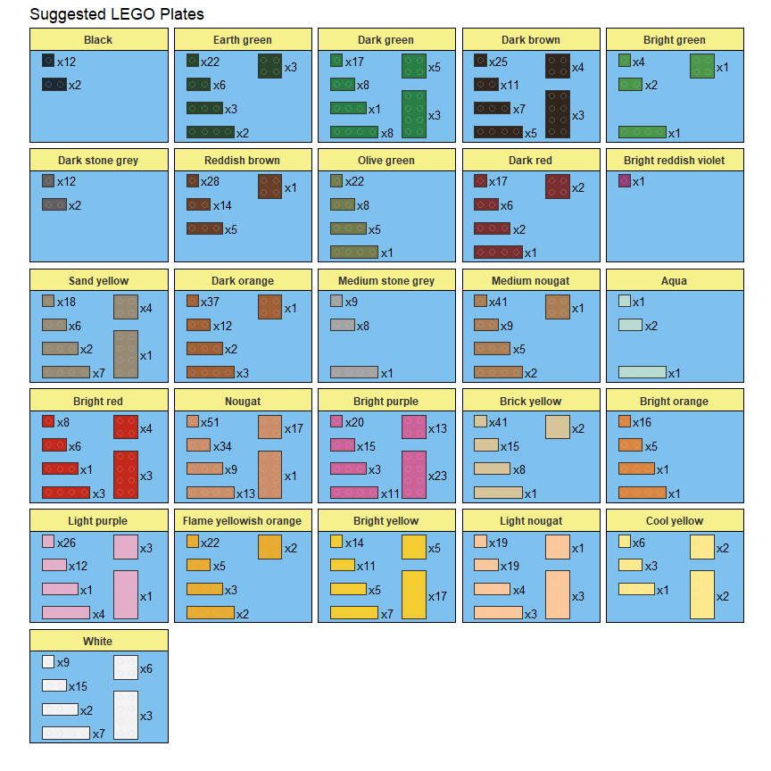
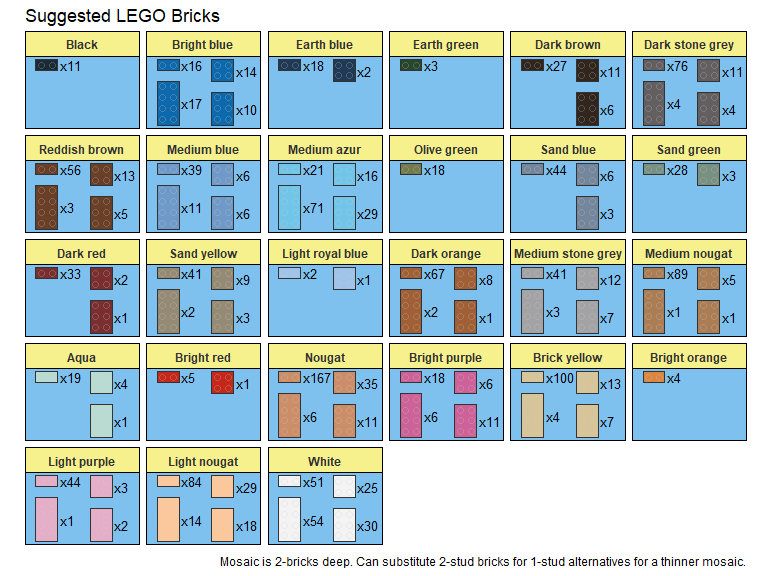
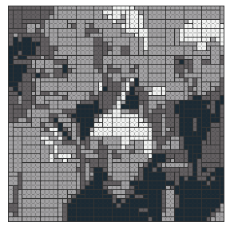

LEGO Mosaics in R
================

Introduction
------------

The functions in the file `0_functions.R` convert a jpg or png image into a mosaic of available LEGO colors and bricks using the R [tidyverse](https://www.tidyverse.org/) and the `jpeg` or `png` packages.

A full explanation can be found on [this blog post](http://www.ryantimpe.com/2018/04/23/lego-mosaic1/) and this [follow-up post](http://www.ryantimpe.com/2018/05/07/lego-mosaic2/).

 

This process is competed in a few distinct steps:

-   `scale_image()` reduces the image to a number of brick "pixels". Providing a single value, such as `48`, crops the image to a square. Inputting a 2-element array, `c(56, 48)`, will output a rectangular image of `c(width, height)`.

-   `legoize()` converts every brick-sized pixel in the scaled image to an official LEGO brick color. Those colors are stored in `Colors/Lego_Colors.csv`. By default, the functions look at only currently produced, non-transparent colors. Use `theme = 'bw'`to create a 4-color grayscale mosaic.

-   `collect_bricks()` looks for adjacent groups of the same color to replace single 1 x 1 bricks with larger bricks.

-   `display_set()` renders the LEGO mosaic as a plot for viewing, creating the image above.

``` r
mosaic1 <- readJPEG("Images/goldengirls.jpg") %>% 
  scale_image(48) %>%
  legoize() %>% 
  collect_bricks() 

mosaic1 %>% display_set()
```

3D Mosaics
----------

Two additional functions can convert the `collect_bricks()` output into a 3D mosaic using the [rayshader](https://github.com/tylermorganwall/rayshader) package by [Tyler Mogran-Wall](https://twitter.com/tylermorganwall).

-   `collect_3d()` translates the 2D LEGO mosaic into two matrices - one for the color image and one for the elevation of each point on the image. By default, the produced image has the height of 6 LEGO plates (2 LEGO bricks) with lighter colors having a higher elevation. Use `mosaic_height` to change the height of the mosaic and set `highest_el = 'dark'` to set the darker colors as the tallest bricks.

-   `display_3d()` simply calls `rayshader::plot_3d()`, but pulls both the hillshade and elevation matrices from the output of `collect_3d()` and fixes the `zscale` value. See `?rayshader::plot_3d()` for more information.

``` r
library(rayshader)

mosaic1 %>% 
  collect_3d() %>% 
  display_3d(fov=0,theta=-20,phi=30,windowsize=c(1000,800),zoom=0.7)

render_snapshot()
```



LEGO Mosaics IRL
----------------

Additional functions assist in the translation from the LEGO mosaic image into a real LEGO set.

### Instructions

Use `generate_instructions()` to break the LEGO mosaic image into easier-to-read steps for building the set. This defaults to 6 steps, but passing any integer value will generate that many steps.

``` r
mosaic1 %>% generate_instructions(9)
```



### Piece list and count

Use `display_pieces()` to generate a graphic and count of all required plates or bricks (for stacked mosaics). These are sorted by color and size for easy purchase on LEGO.com's [Pick-a-Brick](https://shop.lego.com/en-US/Pick-a-Brick) section using the advanced search option. Alternatively, use `table_pieces()` to produce a data frame table of all required bricks.

``` r
mosaic1 %>% display_pieces()
```



Stacked mosaics
---------------

The default produces instructions for a flat LEGO mosaic, with all bricks placed "stud-up" on a plate. Alternatively, specifying `mosaic_type = "stacked"` in the `collect_bricks()` function will generate a mosaic where all bricks are stack on top of each other, resulting in the mosaic image being visible from the side.

A 1 x 1 LEGO brick is taller than it is wide by a ratio of 6/5, so it's recommended to use a wider image.

``` r
m2_lego <- readJPEG("Images/goldengirls2.jpg") %>% 
  scale_image(c(56, 48)) %>% #c(Width, Height) for rectangle
  legoize() %>% 
  collect_bricks("stacked") 
```


``` r
mosaic2 %>% display_pieces()
```



Color options
-------------

For now, you can limit the available LEGO brick colors by filtering rows in the included `Colors/Lego_Colors.csv` file.

You can also use `legoize(theme='bw)` to create a 4-color grayscale mosaic. Set the `contrast` input to be less than or greater than 1 to adjust the allocation of colors.

``` r
readJPEG("Images/goldengirls.jpg") %>% 
  scale_image(48) %>%
  legoize(theme='bw', contrast = 1.25) %>% 
  collect_bricks() %>% 
  display_set()
```


